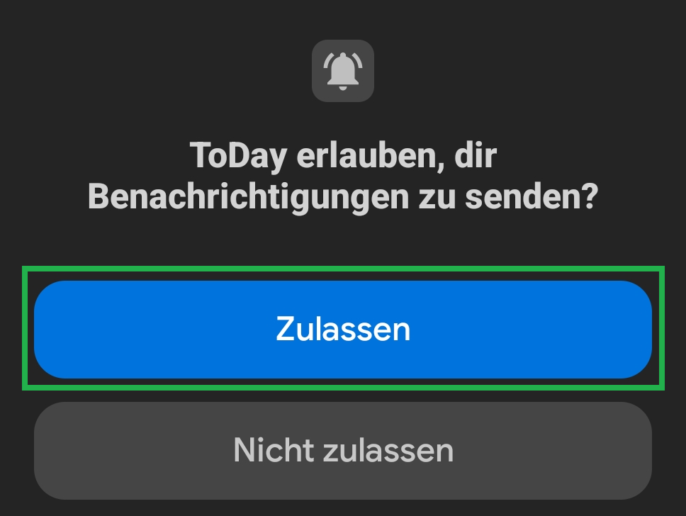

# Berechtigungen

ToDay benötigt nur wenige Freigaben. Richte sie einmalig ein – dann laufen Erinnerungen zuverlässig und pünktlich.

---

## 1) Installation bestätigen

Bei Sideload/USB-Installation bitte den Systemdialog mit **Installieren** bestätigen. (Aus dem Play Store entfällt dieser Schritt.)

---

## 2) Benachrichtigungen erlauben (Android 13+)

Erlaube Benachrichtigungen beim ersten Start mit **Zulassen** – sonst zeigt Android **keine** Erinnerungen an (Zyklen, Zeitansagen, Alarme).

---

## 3) Energiesparen: „Keine Beschränkungen"

Nimm ToDay vom Energiesparen aus (**Keine Beschränkungen**), damit Erinnerungen **pünktlich** ausgelöst werden und nicht vom System verzögert/gebündelt werden.  
Die Bezeichnungen können je nach Gerät/Android-Version variieren (z. B. *Akku-Optimierung*, *Hintergrundaktivität zulassen*).

---

## Technische Details

| Berechtigung | Zweck |
|-------------|-------|
| **Benachrichtigungen** | Notwendig, um Erinnerungen/Alarme anzuzeigen. |
| **Exakte Alarme** *(falls vom System angeboten)* | Ermöglicht die Auslösung exakt zum Zeitpunkt. |
| **Mikrofon** *(nur für Diktat/Sprach-Makros)* | Audio wird nur zur Erkennung genutzt, nicht gespeichert. |
| **Körperliche Aktivität** *(nur für TD:steps:today)* | Zugriff auf den Android-Schrittzähler. |
| **Netzwerkzugriff** | Ausschließlich für DWD-Wetter/Pollen & Erreichbarkeitsprüfung. |

> ToDay verwendet **keine Standortdaten**, **keine Werbung**, **kein Tracking**.  
> Aufgaben & Einstellungen bleiben **lokal** auf deinem Gerät.