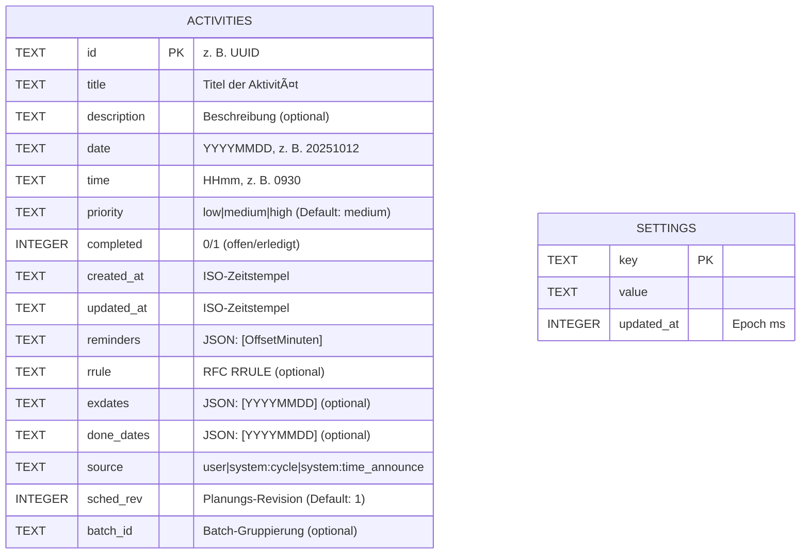
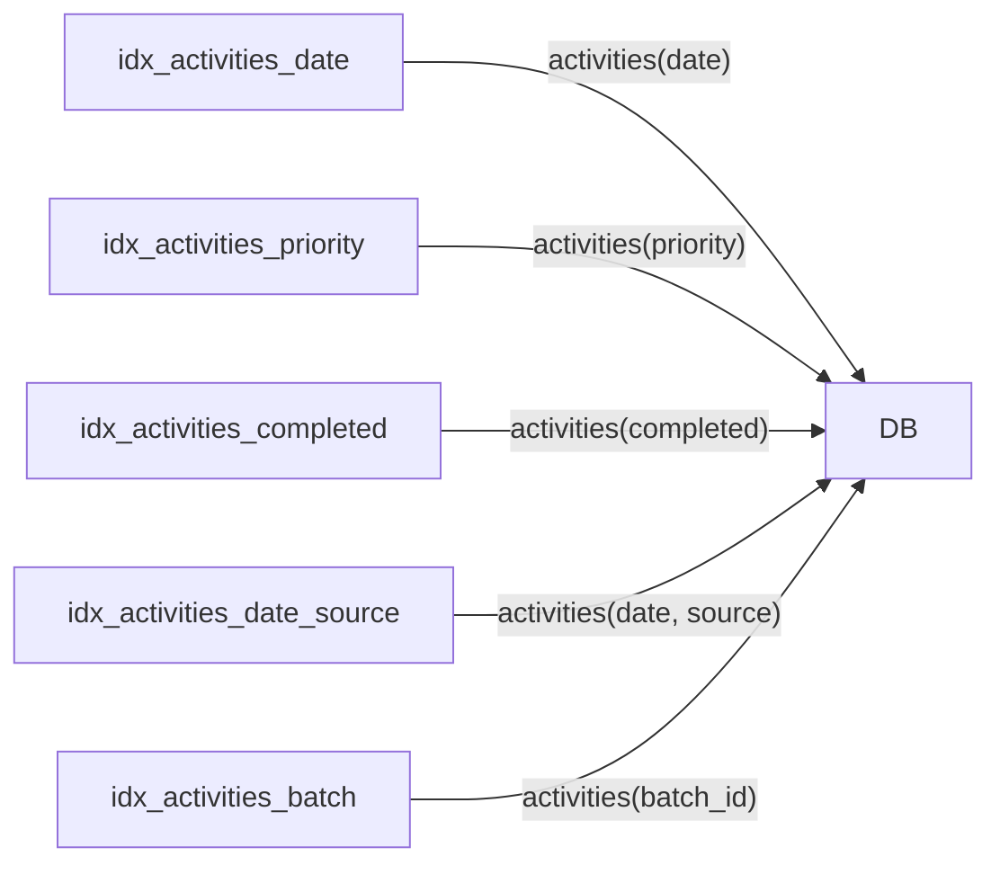

# Info

Der Dialog zeigt technische Informationen zur App, zum System, zur Datenbank und zum Benachrichtigungs-Status. Hilfreich für Support und Diagnose.

---

## 1) Aufruf & Zweck
- Aufruf über das **Menü** der App.  
- Schneller Überblick für **Support** (Kopierfunktion) und **Fehleranalyse**.  

---

## 2) App
- **App**: Name und **Version** (z. B. 1.0.5.1) mit **Kanal** (*Release*, *Beta*, *Debug*).  

---

## 3) System
- **Betriebssystem**: Android-Build des Geräts (z. B. `android AQ3A.240912.001`).  
- **Package-ID**: Eindeutige Paketkennung der App (z. B. `de.mathiashaeuser.today`).  

---

## 4) Datenbank
- **SQLite**: verwendete SQLite-Version.  
- **DB-Pfad**: Verzeichnis der App-Datenbank auf dem Gerät.  
- **DB-Datei**: vollständiger Pfad zur Datenbankdatei (z. B. `.../databases/to_day.db`).  
- **DB-Name**: logischer Name (z. B. `to_day.db`).  
- **Anzahl Einträge**: Summe der Datensätze (Kurzüberblick).  
- **Tabellen**: Anzahl der Tabellen in der Datenbank.  

> Hinweis: Der Pfad ist aus Sicherheitsgründen i. d. R. nicht direkt zugänglich (ohne Root/adb). Für Analysen genügt der **Kopieren**-Button.

### 4.1 Aufbau (Ãœberblick)


- **`activities`** hält alle Aufgaben/Termine inkl. Erinnerungen, Wiederholungen und Metadaten.  
- **`settings`** ist eine schlanke Key/Value-Tabelle für App-Einstellungen (z. B. Flags und Zeitstempel).  

### 4.2 Tabellen im Detail

#### `activities` – deine Aufgaben

| Feld         | Typ     | Pflicht | Beispiel           | Wofür gut |
|--------------|---------|:------:|--------------------|-----------|
| `id`         | TEXT PK | ✅     | `3f1a…-uuid`       | Eindeutige ID der Aktivität. |
| `title`      | TEXT    | ✅     | „Arzttermin“       | Kurztitel / Name. |
| `description`| TEXT    | –      | „Überweisung…“     | Details/Notizen. |
| `date`       | TEXT    | ✅     | `20251012`         | Datum im Format **YYYYMMDD**. |
| `time`       | TEXT    | ✅     | `0930`             | Uhrzeit im Format **HHmm**. |
| `priority`   | TEXT    | ✅     | `low/medium/high`  | Priorität (Default: `medium`). |
| `completed`  | INTEGER | ✅     | `0` / `1`          | Ob erledigt (`1`) oder offen (`0`). |
| `created_at` | TEXT    | ✅     | `2025-10-12T08:40:21Z` | Erstellt-Zeitpunkt (ISO-8601). |
| `updated_at` | TEXT    | ✅     | `2025-10-12T08:45:07Z` | Letzte Änderung (ISO-8601). |
| `reminders`  | TEXT    | –      | `[0,15,60]`        | JSON-Liste von **Offset-Minuten** vor Start. |
| `rrule`      | TEXT    | –      | `FREQ=DAILY;COUNT=10` | **RFC RRULE** für Wiederholungen. |
| `exdates`    | TEXT    | –      | `["20251015"]`     | JSON-Liste **ausgeklammerter** Vorkommen (YYYYMMDD). |
| `done_dates` | TEXT    | –      | `["20251012"]`     | JSON-Liste **erledigter** Vorkommen (bei Serien). |
| `source`     | TEXT    | ✅     | `user` / `system:cycle` / `system:time_announce` | Herkunft: manuell oder System-Features. |
| `sched_rev`  | INTEGER | ✅     | `1`                | **Planungs-Revision** zur Neuplanung/Abgleich. |
| `batch_id`   | TEXT    | –      | `time:20251012`    | **Batch-Kennung** zum Gruppieren. |

**Hinweise & Formate**
- **Datum/Uhrzeit** als kompakte Strings → schnelle Vergleiche & Indizes.  
- **Erinnerungen (`reminders`)**: unterstützte Offsets: `0, 5, 10, 15, 30, 60, 120`.  
- **Wiederholungen (`rrule`)**: Standard-RRULE (z. B. `FREQ=WEEKLY;BYDAY=MO,WE;COUNT=8`).  
  Ausnahmen in `exdates`, erledigte Serien-Vorkommen in `done_dates`.
- **Quellen (`source`)**: `user`, `system:cycle`, `system:time_announce`.  
- **Revision (`sched_rev`)**: erhöht sich bei Neuaufbau von Planungen.  
- **Batch (`batch_id`)**: gruppiert zusammengehörige Items.  

#### `settings` – App-Einstellungen

| Feld        | Typ     | Pflicht | Beispiel                 | Wofür gut |
|-------------|---------|:------:|--------------------------|-----------|
| `key`       | TEXT PK | ✅     | `time_announce.enabled`  | Einstellungs-Schlüssel |
| `value`     | TEXT    | –      | `true` / `{"wpm":12}`    | Wert als Text/JSON |
| `updated_at`| INTEGER | –      | `1734012345678`          | Unix-Millis der letzten Änderung |

**Beispiele für Keys**  
`time_announce.enabled`, `time_announce.cadence`, `tts.voice`, `weather.alerts.enabled`, `pollen.alerts.enabled`, `locale`, `theme.mode`, …

### 4.3 Indizes (für Tempo)


- **Schnelles Listing**: nach Datum, Status, Quelle (z. B. „heute“, „überfällig“, „Zeitansagen“).  
- **Gezieltes Aufräumen**: per `batch_id` ganze Gruppen (z. B. ein Zyklus-Set) schnell finden.  

### 4.4 Beispiel-Datensatz (`activities`)

```json
{
  "id": "8a2f2e8b-0e7b-4b31-9a7a-9f2b1b5d2c4e",
  "title": "Arzttermin",
  "description": "Ãœberweisung und Versichertenkarte",
  "date": "20251203",
  "time": "0930",
  "priority": "high",
  "completed": 0,
  "created_at": "2025-11-20T08:12:51Z",
  "updated_at": "2025-11-20T08:13:22Z",
  "reminders": "[0,15,60]",
  "rrule": null,
  "exdates": null,
  "done_dates": null,
  "source": "user",
  "sched_rev": 1,
  "batch_id": null
}
```

### 4.5 Häufige Fragen

- **Warum sind Datum/Uhrzeit als Text gespeichert?**  
  Für schnelle Indizes/Sortierung und robuste Vergleiche (z. B. `WHERE date='20251203'`).

- **Kann ich die DB außerhalb der App öffnen?**  
  Ja, mit einem SQLite-Viewer. Der Pfad ist i. d. R. nur per ADB/Root erreichbar. Der **Kopieren**-Button im Info-Dialog genügt in der Regel für Support.

### 4.6 Für Technik-Fans (wie wird geplant?)
- Benachrichtigungen werden mit einer **deterministischen ID** aus `id + date + offsetMin` geplant.  
- Jede geplante Erinnerung trägt eine **Payload** (u. a. `activity_id`, `ymd`, `source`, `sched_rev`).  
- Beim Aufräumen kann die App so **zielsicher** alle zugehörigen Alarme finden und **abbrechen/neu planen** – auch bei Serien, Zeitansagen und Zyklus-Sets.  

### 4.7 Installation & Deinstallation (Android)

**Wie wird die Datenbank angelegt?**  
- Beim **ersten Start** (bzw. beim ersten Zugriff auf die Datenbank) öffnet die App die SQLite-Datei über den `DatabaseHelper`.  
- Existiert die Datei noch nicht, wird sie **automatisch erstellt** (üblich: `.../data/data/<package>/databases/to_day.db`).  
- Im Zuge dessen werden die **Tabellen** (`activities`, `settings`) und benötigte **Spalten**/Indizes angelegt. Spätere App-Versionen führen **Migrationen** aus (fehlende Spalten werden ergänzt), ohne bestehende Daten zu verlieren.  

**Welche Voraussetzungen braucht Android?**  
- **Keine zusätzlichen Berechtigungen nötig.** Die Daten liegen im **app-internen Speicher** (keine „Dateizugriff“-Runtime-Permission erforderlich).  
- Android bringt **SQLite** systemseitig mit; Pfade liefert Flutter über `path_provider`.  
- Es muss **ausreichend freier Speicherplatz** vorhanden sein.  

**Was passiert bei der Deinstallation?**  
- Android löscht den kompletten **App-Sandbox-Bereich** automatisch, inklusive der Datenbank unter `.../data/data/<package>/databases/to_day.db`.  
- Auch geplante **Benachrichtigungen/Alarme** der App werden vom System verworfen, da das Paket nicht mehr vorhanden ist.  
- Es bleiben **keine Reste** der App-Datenbank im System zurück – das Gerät ist diesbezüglich **sauber**.  

---

### 4.8 Weitere gespeicherte App-Parameter (außerhalb der Datenbank)

> Zusätzlich zur SQLite-Datenbank speichert ToDay einige Parameter **geräteintern** (Sandbox). Alles liegt im App-Bereich und wird bei **Deinstallation automatisch entfernt**.

#### 4.8.1 Shared Preferences (Key/Value, Klartext)

* **Ort**: App-Sandbox (`/data/data/<package>/shared_prefs/...`) – intern, ohne Root/ADB nicht direkt zugänglich.  
* **Typ**: Kleine Einstellungen/Flags als **Key/Value** (String, Bool, Double, Int).  

**TTS (vereinheitlichtes Schema)**

| Key             | Typ    | Beispiel                 | Beschreibung                                                 |
|-----------------|--------|--------------------------|--------------------------------------------------------------|
| `tts.enabled`   | Bool   | `true`                   | TTS global an/aus.                                           |
| `tts.engine`    | String | `com.google.android.tts` | Vom System gemeldete Engine; Anzeige in der App.             |
| `tts.locale`    | String | `de-DE`                  | Sprache im Format `ll-CC` (Bindestrich, normiert).           |
| `tts.voiceName` | String | `German Germany`         | Exakter Anzeigename aus `getVoices`.                         |
| `tts.rate`      | Double | `1.0`                    | Sprechtempo `0.20–1.00`.                                     |
| `tts.pitch`     | Double | `1.0`                    | Tonhöhe `0.50–1.50`.                                         |
| `tts.volume`    | Double | `1.0`                    | Lautstärke `0.00–1.00`.                                      |

**Gamification – gesprochene Sätze**

| Key                       | Typ                 | Beispiel                                            | Beschreibung                                                                 |
|---------------------------|---------------------|-----------------------------------------------------|-------------------------------------------------------------------------------|
| `tts.gamify.sentences.de` | String (JSON-Liste) | `["Du räumst auf wie ein Boss.", "…"]`              | Benutzerdefinierte **DE**-Sätze. Leere/ungültige Liste → Fallback auf L10N.   |
| `tts.gamify.sentences.en` | String (JSON-Liste) | `["You're cleaning up like a boss.", "…"]`          | Benutzerdefinierte **EN**-Sätze. Leere/ungültige Liste → Fallback auf L10N.   |

**Hintergrund-Animation (Lottie, pro Monat)**

| Key               | Typ    | Beispiel                                                      | Beschreibung                                                                 |
|-------------------|--------|---------------------------------------------------------------|-------------------------------------------------------------------------------|
| `lottie.default`  | String | `assets/lottie/Cat playing animation.json`                    | Standard-Animation (**voller Asset-Pfad**).                                   |
| `lottie.month.01` | String | `assets/lottie/Happy snowman jumping and waving his hand.json`| Monatszuordnung Januar (**voller Asset-Pfad**).                               |
| … `lottie.month.12` | String | `assets/lottie/Thanksgiving Basket.json`                   | Monatszuordnung Dezember (**voller Asset-Pfad**). Fehlender Key → erbt Standard. |
| `lottie.month.MM` | String | `"<none>"`                                                    | **Kein Bild** für Monat `MM` (Animation explizit deaktiviert).                |

> **UI-Hinweis:** In der Auswahl kann der sichtbare Text den Pfadteil `assets/lottie/` ausblenden. Gespeichert wird stets der **vollständige** Asset-Pfad.

**Weitere Beispiele (nicht TTS/Lottie/Gamification):**

| Key                                | Typ    | Beispiel   | Beschreibung                               |
|------------------------------------|--------|------------|--------------------------------------------|
| `ui.theme`                         | String | `system`   | Erscheinungsbild: `light`/`dark`/`system`. |
| `locale.override`                  | String | `de`       | App-Sprache erzwingen (sonst System).      |
| `home.last_open_date`              | String | `20251203` | Letztverwendetes Datum im Hauptbildschirm. |
| `cleanup.only_open.default`        | Bool   | `true`     | Vorauswahl im Aufräumen-Dialog.            |
| `cleanup.cancel_schedules.default` | Bool   | `true`     | Vorauswahl für „Alarme stornieren“.        |
| `time_announce.enabled`            | Bool   | `true`     | Zeitansagen an/aus.                        |
| `weather.units.temp`               | String | `C`        | Temperatureinheit.                         |
| `typography.fontFamily`            | String | `system`   | Schriftart: `system`/`inter`/`robotoSlab`/`openDyslexic`. |
| `typography.textScaleFactor`       | Double | `1.0`      | Schriftgrößen-Faktor (0.8–1.5). |

#### 4.8.2 Secure Storage (verschlüsselt)

* **Ort**: App-Sandbox, über Android Keystore abgesichert (Plugin `flutter_secure_storage`).  
* **Typ**: **Sensible** Schlüssel/Werte, verschlüsselt gespeichert.  

| Key               | Typ    | Beispiel | Beschreibung                  |
|-------------------|--------|----------|-------------------------------|
| `auth.token`      | String | `…`      | Zugangstoken (falls genutzt). |
| `privacy.consent` | Bool   | `true`   | Merker für Einwilligungen.    |

> **Hinweis:** TTS-, Gamification- und Lottie-Einstellungen werden **nicht** im Secure Storage abgelegt, sondern in **Shared Preferences** (siehe oben).

#### 4.8.3 Plugin-/Systemspeicher

* **Awesome Notifications**: persistiert geplante & aktive Benachrichtigungen (inkl. Payload) im App-Bereich; wird im **Aufräumen**/„Neu aufbauen“ konsistent bereinigt/neu befüllt.  
* **Image-/Netz-Cache**: Zwischenspeicher im **Cache-Verzeichnis** der App.  
* **Temporary Files**: Kurzlebige Dateien (z. B. Exporte) im **Temp-/Cache-Pfad**.  

#### 4.8.4 Exporte/Backups (optional)

* Exportierte Dateien liegen im **vom Nutzer gewählten Ordner** (z. B. „Downloads“) und damit **außerhalb** der App-Sandbox.  
* Diese Dateien bleiben auch nach Deinstallation erhalten, bis sie manuell gelöscht werden.  

#### 4.8.5 Lösch- & Backup-Verhalten

* **App-Daten löschen** entfernt Datenbank, Shared Preferences, Secure Storage, Plugin-Daten und Cache.  
* **Deinstallation** entspricht effektiv „Alles löschen“.  
* **System-Backups** (falls aktiv) können Einstellungen/Prefs wiederherstellen; sicherheitskritische Inhalte im Secure Storage werden i. d. R. **nicht** zwischen Geräten migriert.  

#### 4.8.6 Datenschutz

* Keine Telemetrie standardmäßig.  
* Alle Daten verbleiben **lokal** auf dem Gerät, außer du exportierst/synchronisierst sie bewusst.  

---

## 5) Benachrichtigungen
Status-Chips zeigen, ob alle Voraussetzungen erfüllt sind:
- **Erlaubt** – Systemberechtigung für Benachrichtigungen ist erteilt.  
- **Exakte Alarme** – erlaubt, damit Erinnerungen **pünktlich** auslösen dürfen.  
- **Akku-Optimierung ignoriert** – verhindert Drosselung im Hintergrund.  

> Wenn einer der Schalter **aus** ist, können Erinnerungen **zu spät** oder **gar nicht** kommen. Öffne die entsprechenden System-Einstellungen und erlaube die Option.

---

## 6) Aktionen
- **Kopieren**: Kopiert alle angezeigten Informationen in die Zwischenablage (für Support/Fehlerbericht).  
- **Schließen**: Beendet den Dialog.  

---

## 7) Tipps & Fehlerbehebung
- Nach Änderungen an Rechten/Alarmen in den **Einstellungen** ggf. **„Benachrichtigungen neu aufbauen“** ausführen.  
- Prüfe zusätzlich Ruhezeiten, „Nicht stören“ und Internet-Verbindung (für DWD/Pollen).  
- Bei Support-Anfragen den kopierten **Info-Block** mit senden.  

---

## 8) Android Debug Version erstellen

### 8.1 Voraussetzungen
- Android Studio mit SDK [SDK Platform: Android 16.0 "Baklava", SDK Tool: 36.0.0] und Platform Tools [Flutter 3.32.8, Dart SDK version: 3.8.1]  
- USB Debugging am Gerät [Entwickleroptionen aktivieren: Einstellungen → Über das Telefon → Detaillierte Infos und Spezifikationen → auf OS Version oder MIUI Version 7 bis 10 mal tippen, bis die Meldung kommt, dass du Entwickler bist. USB Debugging einschalten: Einstellungen → Zusätzliche Einstellungen → Entwickleroptionen → USB Debugging aktivieren.]  

### 8.2 Prüfen
```
flutter --version
dart --version
flutter doctor -v
```

### 8.3 Projekt vorbereiten
```
cd X:\apps\to-day\android
.\gradlew --stop
cd ..
cd X:\apps\to-day
flutter clean
flutter pub get
flutter gen-l10n
```

### 8.4 Debug starten
```
flutter run
```

---

## 9) Android Release Version erstellen

### 9.1 Voraussetzungen
- Android Studio mit SDK [SDK Platform: Android 16.0 "Baklava", SDK Tool: 36.0.0] und Platform Tools [Flutter 3.32.8, Dart SDK version: 3.8.1]  
- USB am Gerät  

### 9.2 Prüfen
```
flutter --version
dart --version
flutter doctor -v
```

### 9.3 Projekt vorbereiten
```
cd X:\apps\to-day\android
.\gradlew --stop
cd ..
cd X:\apps\to-day
flutter clean
flutter pub get
flutter gen-l10n
```

### 9.4 Release starten
```
flutter run --release
```

---

## 10) Android AppBundle für Google Play Console erstellen

### 10.1 Voraussetzungen
- Android Studio mit SDK [SDK Platform: Android 16.0 "Baklava", SDK Tool: 36.0.0] und Platform Tools [Flutter 3.32.8, Dart SDK version: 3.8.1]  
- X:\apps\to-day\android\key.properties  
- X:\apps\to-day\android\app\upload-keystore.jks  

### 10.2 Prüfen
```
flutter --version
dart --version
flutter doctor -v
```

### 10.3 Projekt vorbereiten
```
cd X:\apps\to-day\android
.\gradlew --stop
cd ..
cd X:\apps\to-day
.\gradlew --stop
taskkill /F /IM gradle* /T

# Projektbezogene Gradle Caches und Builds löschen
Remove-Item -Recurse -Force ".gradle" -ErrorAction Ignore
Remove-Item -Recurse -Force "app\build" -ErrorAction Ignore

cd X:\apps\to-day\android
.\gradlew --stop
cd ..
cd X:\apps\to-day
flutter clean
flutter pub get
flutter gen-l10n
flutter build appbundle --release
```

---

## 11) Windows Debug Version erstellen

### 11.1 Voraussetzungen
- Platform Tools [Flutter 3.32.8, Dart SDK version: 3.8.1]  

### 11.2 Prüfen
```
flutter --version
dart --version
flutter doctor -v
```

### 11.3 Projekt vorbereiten
```
cd X:\apps\to-day\android
.\gradlew --stop
cd ..
cd X:\apps\to-day

$nuDir = "$env:USERPROFILE\nuget"
New-Item -ItemType Directory -Force $nuDir | Out-Null
Invoke-WebRequest https://dist.nuget.org/win-x86-commandline/latest/nuget.exe -OutFile "$nuDir\nuget.exe"
$env:NUGET_EXE = "$nuDir\nuget.exe"
Test-Path $env:NUGET_EXE
flutter clean
Remove-Item -Recurse -Force .\windows\flutter\ephemeral -ErrorAction SilentlyContinue
Remove-Item -Recurse -Force .\build\windows -ErrorAction SilentlyContinue
flutter pub get
flutter gen-l10n
```
bzw.

```
cd X:\apps\to-day

$nuDir = "$env:USERPROFILE\nuget"
$env:Path = "$nuDir;$env:Path"
Set-Location X:\apps\to-day

flutter doctor -v
flutter clean
Remove-Item -Recurse -Force .\windows\flutter\ephemeral -ErrorAction SilentlyContinue
Remove-Item -Recurse -Force .\build\windows -ErrorAction SilentlyContinue
flutter pub get
flutter gen-l10n
```

### 11.4 Debug starten
```
flutter run -d windows
```

---

## 12) Windows Release Version erstellen

### 12.1 Voraussetzungen
- Platform Tools [Flutter 3.32.8, Dart SDK version: 3.8.1]  

### 12.2 Prüfen
```
flutter --version
dart --version
flutter doctor -v
```

### 12.3 Projekt vorbereiten
```
cd X:\apps\to-day\android
.\gradlew --stop
cd ..
cd X:\apps\to-day

$nuDir = "$env:USERPROFILE\nuget"
New-Item -ItemType Directory -Force $nuDir | Out-Null
Invoke-WebRequest https://dist.nuget.org/win-x86-commandline/latest/nuget.exe -OutFile "$nuDir\nuget.exe"
$env:NUGET_EXE = "$nuDir\nuget.exe"
Test-Path $env:NUGET_EXE
flutter clean
Remove-Item -Recurse -Force .\windows\flutter\ephemeral -ErrorAction SilentlyContinue
Remove-Item -Recurse -Force .\build\windows -ErrorAction SilentlyContinue
flutter pub get
flutter gen-l10n
```
bzw.

```
cd X:\apps\to-day\android
.\gradlew --stop
cd ..
cd X:\apps\to-day

$nuDir = "$env:USERPROFILE\nuget"
$env:Path = "$nuDir;$env:Path"
Set-Location X:\apps\to-day

flutter doctor -v
flutter clean
Remove-Item -Recurse -Force .\windows\flutter\ephemeral -ErrorAction SilentlyContinue
Remove-Item -Recurse -Force .\build\windows -ErrorAction SilentlyContinue
flutter pub get
flutter gen-l10n
```

### 12.4 Release starten
```
flutter run -d windows --release
```

---

## 13) Android Emulator Debug Version erstellen

### 13.1 Voraussetzungen
- Android Studio mit SDK [SDK Platform: Android 16.0 "Baklava", SDK Tool: 36.0.0] und Platform Tools [Flutter 3.32.8, Dart SDK version: 3.8.1]  

### 13.2 Prüfen
```
flutter --version
dart --version
flutter doctor -v
```

### 13.3 Projekt vorbereiten
```
flutter emulators
flutter emulators --launch Medium_Phone_API_36.0
flutter devices

cd X:\apps\to-day\android
.\gradlew --stop
cd ..
cd X:\apps\to-day
flutter clean
flutter pub get
flutter gen-l10n
```

### 13.4 Debug starten
```
flutter run -d emulator-5554
```

---

## 14) Android Emulator Release Version erstellen

### 14.1 Voraussetzungen
- Android Studio mit SDK [SDK Platform: Android 16.0 "Baklava", SDK Tool: 36.0.0] und Platform Tools [Flutter 3.32.8, Dart SDK version: 3.8.1]  

### 14.2 Prüfen
```
flutter --version
dart --version
flutter doctor -v
```

### 14.3 Projekt vorbereiten
```
flutter emulators
flutter emulators --launch Medium_Phone_API_36.0
flutter devices

cd X:\apps\to-day\android
.\gradlew --stop
cd ..
cd X:\apps\to-day
flutter clean
flutter pub get
flutter gen-l10n
```

### 14.4 Release starten
```
flutter run --release -d emulator-5554
```

---

## 15) App Log aufnehmen 

### 15.1 Handlungen
- Gerät neu starten.  
- Sauberes App Log aufnehmen, damit wir echte App Fehler sehen.  

### 15.2 Befehle zum Aufzeichnen

```
adb logcat -c
adb logcat -v time -b all > log.txt
```
- Dann Problem auslösen. Danach Datei prüfen.  
- Nur deine App filtern  

```
adb logcat -v time | Select-String -Pattern "FATAL EXCEPTION|de.mathiashaeuser.today"
```


