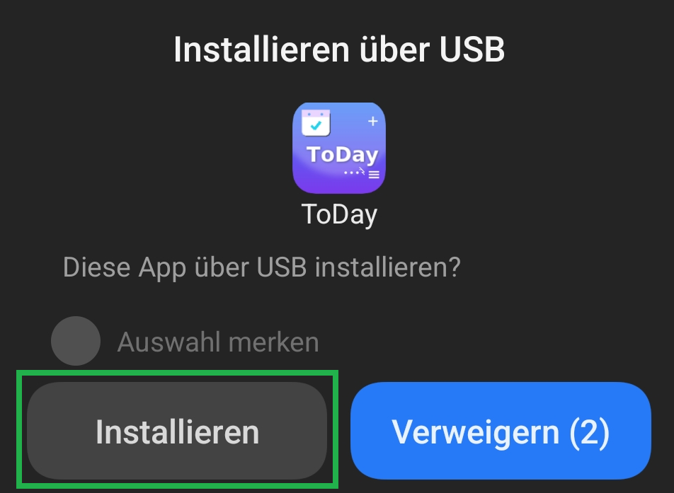
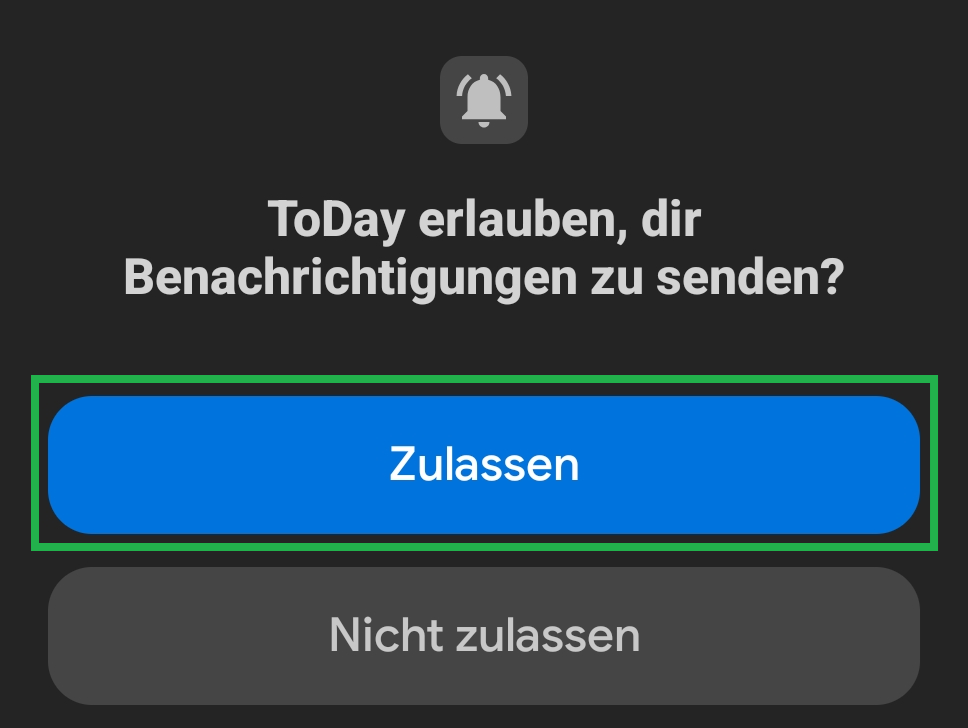
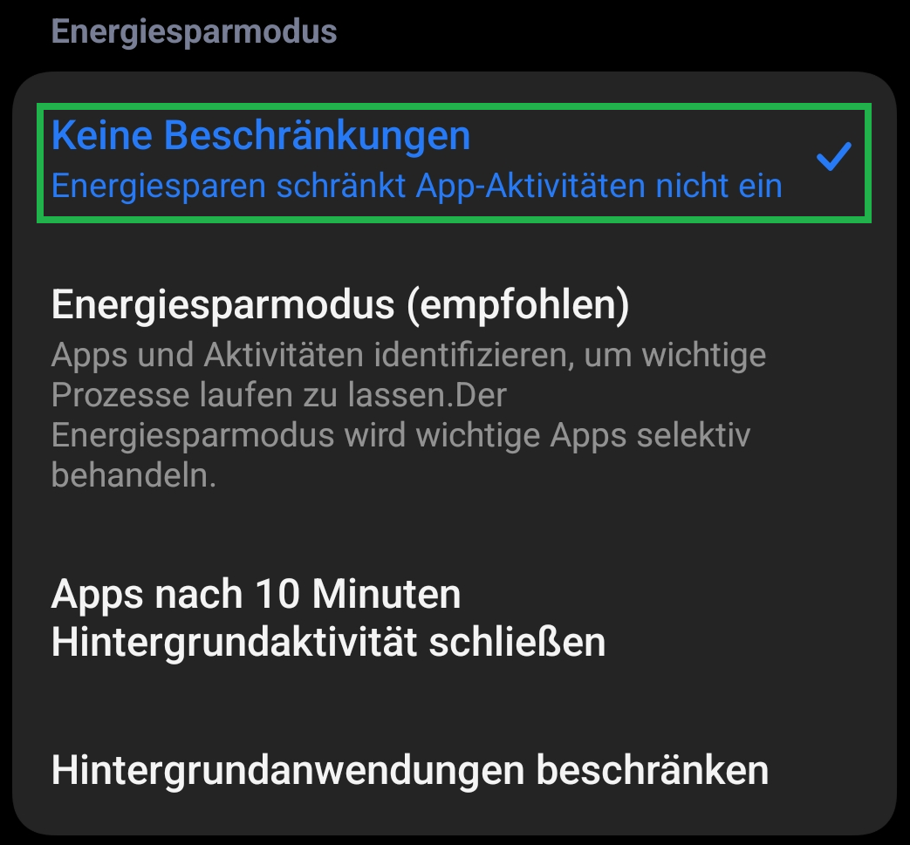

# Permissions

ToDay requires only a few permissions. Set them up once and reminders will run reliably and on time.

---

## 1) Confirm installation

For sideload or USB installation, please confirm the system dialog with **Install**. (This step is skipped when installing from the Play Store.)

---

## 2) Allow notifications (Android 13+)

Allow notifications on first launch with **Allow** – otherwise Android will **not** show any reminders (cycles, time announcements, alarms).

---

## 3) Power saving: "No restrictions"

Exclude ToDay from power saving (**No restrictions**) so reminders are triggered **on time** and not delayed/batched by the system.  
Labels may vary depending on device/Android version (e.g., *Battery optimization*, *Allow background activity*).

---

## Technical details

| Permission | Purpose |
|------------|---------|
| **Notifications** | Required to display reminders/alarms. |
| **Exact alarms** *(if offered by the system)* | Allows firing exactly at the scheduled time. |
| **Microphone** *(only for dictation/voice macros)* | Audio is used only for recognition, not stored. |
| **Physical activity** *(only for TD:steps:today)* | Access to the Android step counter. |
| **Network access** | Exclusively for DWD weather/pollen & reachability check. |

> ToDay uses **no location data**, **no ads**, **no tracking**.  
> Tasks & settings stay **local** on your device.